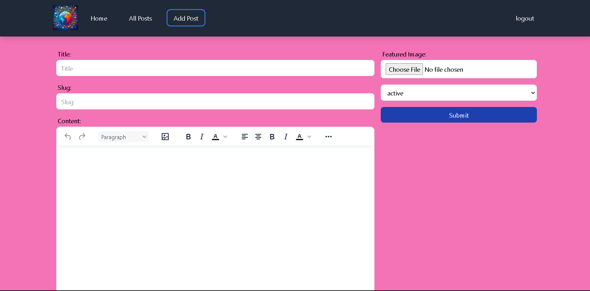

# BlogVerse

**BlogVerse** is a modern blogging platform built with **React**, **Redux**, and **Appwrite**. It offers a sleek and user-friendly interface for managing and publishing blog content. The application provides essential features such as user authentication, blog creation, and blog management.

## Features

- **User Authentication**: Secure login and access management using Appwrite.
- **Create Blogs**: Easily create and upload new blog posts.
- **Manage Blogs**: View, edit, and delete your existing blog posts.
- **Active and Inactive Posts**: Filter and manage posts based on their status. Only the creator can view inactive posts.
- **Rich Text Editing**: Use TinyMCE for a powerful and intuitive rich text editor to write post's content.
- **User Dashboard**: Access a personalized dashboard to manage your content.

## Technology Stack

- **React**: A JavaScript library for building user interfaces.
- **Redux**: A state management library for React applications.
- **Appwrite**: A backend-as-a-service platform for authentication and data storage.
- **TinyMCE**: A rich text editor for creating and formatting content.

## Screenshots

Here are some images related to the BlogVerse project:

  
  
  
  
  

